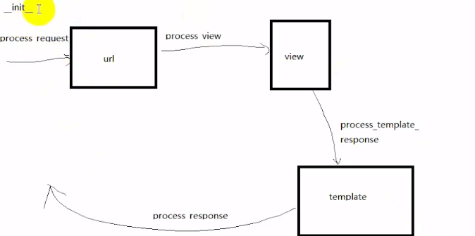

# Django 提升

## 高级扩展

- 静态文件
  - css、js、图片、json文件、字体文件等
  - 配置 settings.py

      ```python
      STATIC_URL = '/static/'
      STATICFILES_DIRS = [
        os.path.join(BASE_DIR, 'static'),
      ]
      ```

  - 加载静态文件，在模板文件第一行添加：``
    - 加载静态文件标签：``
      - 示例：``

- 中间件
  - 概述：一个轻量级、底层的插件，可以介入 Django 的请求和响应
  - 本质：一个 python 类

  - 方法
    - `__init__`：不需要传参数，服务器响应第一个请求的时候自动调用，用于确定是否启用该中间件
    - `process_request(self,request)`：在执行视图之前被调用（url 分配试图之前），每个请求上都会调用，返回 None 或者 HttpResponse 对象
    - `process_view(self,request,view_func,view_args,view_kwargs)`：在调用试图之前执行，每个请求上都会调用，返回 None 或者 HttpResponse 对象
    - `process_template_reponse(self,request,response)`：在视图刚好执行完后调用，每个请求上都会调用，返回 None 或者 HttpResponse 对象，以及使用 render
    - `process_reponse(self,response)`：在执行 template 后调用，所有响应返回浏览器之前调用，每个请求上都会调用，返回 HttpResponse 对象
    - `process_exception(self,exception)`：当只有在视图函数中抛出异常时调用，返回 HttpResponse 对象

    执行顺序：

    

  - 自定义中间件
    - 项目目录下创建中间件目录，中间件目录下创建 app 目录，app 目录下创建中间件（python 文件）

      ```python
      from django.utils.deprecation import MiddlewareMixin


      class MyMiddle(MiddlewareMixin):
          def process_request(self, request):
              print("get参数为：", request.GET.get('a'))
      ```

  - 使用自定义中间件
    - 在 `settings.py` 的 `MIDDLEWARE` 中添加 `middleware.myApp.myMiddle.MyMiddle`
    - 默认会处理所有请求
    - 注意写法

  - 上传图片
    - 概述：文件上传时，文件数据存储在 request.FILES 属性中
      - 注意：form 表单上传文件需要加 `enctype="multipart/form-data"`
      - 上传文件必须是 POST 请求
    - 存储路径：在 static 目录下创建 uploadfile，用于存储接收上传的文件
      - 配置 settings.py：`MEDIA_ROOT = os.path.join(BASE_DIR, r'static\uploadfile')`
      - 代码示例：

        ```python
        <form method="POST" action="/sunck/savefile/" enctype="multipart/form-data">
            
            <input type="file" name="file">
            <input type="submit" value="上传">
        </form>

        # 文件上传
        def uploadfile(request):
            return render(request, 'myApp/uploadfile.html')


        import os
        from django.conf import settings


        def savefile(request):
            # print("****")
            # print(request.method)
            # print(request.FILES)
            # print(type(request.FILES))
            if request.method == 'POST':
                f = request.FILES['file']
                # print(f)
                # print(f.name)
                # print(type(f))
                # 文件在服务器的路径
                filePath = os.path.join(settings.MEDIA_ROOT, f.name)
                with open(filePath, 'wb') as fp:
                    # 以文件流的形式一段一段写入
                    for info in f.chunks():
                        fp.write(info)
                return HttpResponse("上传成功")
            else:
                return HttpResponse("上传失败")
            ```

- 分页
  - Paginator 对象
    - 创建对象
      - 格式：`Paginator(列表,整数)`
      - 返回值：返回的分页对象
    - 属性
      - count：对象总数
      - num_pages：页面总数
      - page_range：页面列表，如 [1,2,3,4,7]，页码从1开始
    - 方法
      - page(num)：获得一个 Page 对象，如果提供的页码不存在会抛出一个 InvalidPage 异常
    - 异常
      - InvalidPage：当向 page() 传递的是一个无效的页码时抛出
      - PageNotAnInteger：当向 page() 传递的不是一个整数时抛出
      - EmptyPage：当向 page() 传递一个有效值，但是该页面没有数据时抛出

  - Page 对象
    - 创建对象
      - Paginator 对象的 page() 方法返回得到 Page 对象
      - 不需要手动创建
    - 属性
      - object_list：当前页上所有的数据（对象）列表
      - number：当前页的页码值
      - paginator：当前 page 对象的关联的 Paginator 对象
    - 方法
      - has_next()：判断是否有下一页，如果有就返回 True
      - has_previous()：判断是否有上一页，如果有就返回 True
      - has_other_page()：判断是否有上一页或下一页，如果有就返回 True
      - next_page_number()：返回下一页的页码，如果下一页不存在，抛出 InvalidPage 异常
      - previous_page_number()：返回上一页的页码，如果上一页不存在，抛出 InvalidPage 异常
      - len()：返回当前页的数据（对象）个数

  - Paginator 对象与 Page 对象关系

      

  - 实例：

    ```python
    # url
    url(r'^studentpage/(\d+)/$', views.studentpage)

    from django.core.paginator import Paginator
    # 分页
    def studentpage(request, pageid):
        # 所有学生列表
        allList = Students.stuObject2.all()

        paginator = Paginator(allList, 2)
        page = paginator.page(pageid)

        return render(request, 'myApp/studentpage.html', {'students': page})

    # html
    <ul>
        
        <li>
            {{stu.sname}}--{{stu.sgrade}}
        </li>
        
    </ul>

    <ul>
        
            
                <li>
                    {{index}}
                </li>
            
                <li>
                    <a href="/sunck/studentpage/{{index}}/">{{index}}</a>
                </li>
            
        
    </ul>
    ```

- ajax：需要动态生成，请求 json 数据
  - 待补充

- 富文本
  - `pip install django-tinymce`
  - 在站点中使用
    - 配置 `settings.py` 的 INSTALLED_APPS 添加 tinymce 并增加：

      ```python
      # 富文本
      TINYMCE_DEFAULT_CONFIG = {
            'theme': 'advanced',
            'width': 600,
            'height': 400,
      }
      ```

  - 创建一个模型类，并进行数据迁移

    ```python
    from tinymce.models import HTMLField


    class Text(models.Model):
        str = HTMLField()
    ```

  - 配置站点
    - 在 `admin.py` 中添加

        ```python
        from .models import Text

        admin.site.register(Text)
        ```

  - 在自定义视图（页面）中使用
    - 示例代码：`F:\Github_Repo\Python_notes\Django\myproject\templates\myApp\edit.html`

- celery
  - 官网：https://docs.celeryproject.org/en/stable/
  - 问题
    - 用户发起请求（request），并且要等待 response 返回，但是在视图中有一些耗时的操作，导致用户可能会等待很长一段时间
    - 网站每隔一段时间要同步一次数据，但是 http 请求时是需要触发的
  - 解决
    - celery 解决
      - 将耗时的操作放到 celery 中执行
      - 使用 celery 定时执行

  - celery
    - 任务（task）：本质是一个 python 函数，将耗时操作封装成一个函数
    - 队列（queue）：将要执行的任务放在队列里
    - 工人（worker）：负责执行队列中的任务
    - 代理（broker）：负责调度，在部署环境中使用 redis

  - 安装
    - `pip install celery`
    - `pip install celery-with-redis`
    - `pip install django-celery`

  - 配置 `settings.py`
    - INSTALLED_APPS 添加 djcelery
    - 末尾添加

      ```python
      # celery
      import djcelery
      djcelery.setup_loader()  # 初始化
      BROKER_URL='redis://:sunck@127.0.0.1:6379/0'
      CELERY_IMPORTS=('myApp.task')
      ```

  - 在应用 app 目录下创建 `task.py` 文件

  - 迁移生成 celery 需要的数据库表

    ```bash
    F:\Github_Repo\Python_notes\Django\myproject>python manage.py migrate
    Operations to perform:
    Apply all migrations: admin, auth, contenttypes, djcelery, myApp, sessions
    Running migrations:
    Applying djcelery.0001_initial... OK
    ```

  - 在项目 project 目录下创建 `celery.py` 文件
  - 在项目 project 目录下的 `__init__.py` 文件中添加
