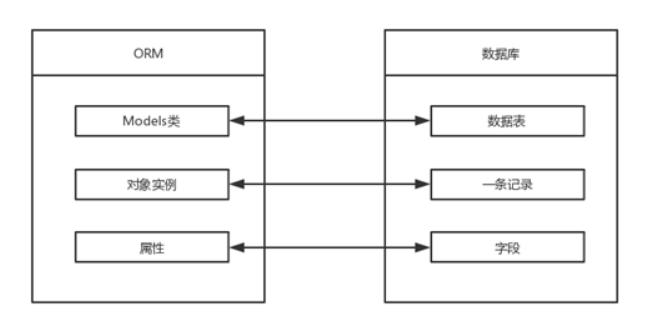
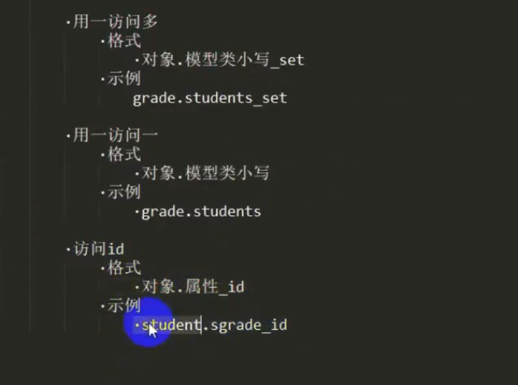

# Django Model

Django 对各种数据库提供了很好的支持，包括：PostgreSQL、MySQL、SQLite、Oracle。

Django 为这些数据库提供了统一的调用API。 我们可以根据自己业务需求选择不同的数据库。

Django 模型使用自带的 ORM。

对象关系映射（Object Relational Mapping，简称 ORM ）用于实现面向对象编程语言里不同类型系统的数据之间的转换。

- ORM 在业务逻辑层和数据库层之间充当了桥梁的作用。

- ORM 是通过使用描述对象和数据库之间的映射的元数据，将程序中的对象自动持久化到数据库中。


使用 ORM 的好处：

- 提高开发效率。
- 不同数据库可以平滑切换。

使用 ORM 的缺点：

- ORM 代码转换为 SQL 语句时，需要花费一定的时间，执行效率会有所降低。
- 长期写 ORM 代码，会降低编写 SQL 语句的能力。

ORM 解析过程:

1. ORM 会将 Python 代码转成为 SQL 语句。
2. SQL 语句通过 pymysql 传送到数据库服务端。
3. 在数据库中执行 SQL 语句并将结果返回。

ORM 与数据库对应关系表：



参考资料：[Django 模型-菜鸟](https://www.runoob.com/django/django-model.html)

## 关联关系

具体分类:

- `ForeignKey`：一对多，将字段定义在多的端中，如：一个家庭有多个人，一般通过外键来实现
- `ManyToManyField`：多对多，将字段定义在两端中，如：一个学生有多门课程，一个课程有很多学生，一般通过第三个表来实现关联。
- `OneToOneField`：一对一，经字段定义在任意一端中，如：一个人对应一个身份证号码，数据字段设置 unique。

如图：


## 模型成员

- 模型属性：`objects` ，是 `Manager` 类型的一个对象，作用是与数据库进行交互
  - 当定义模型类没有指定管理器，则Django为模型创建一个名为 `objects` 的管理器
  - 可以自定义模型管理器：`people = models.Manager()`，那么 `objects` 就不存在了
    - 没有定义管理器时：`Person.objects.all()` 返回包含所有 Person 对象的列表。
    - 定义了管理器时：`Person.people.all()` 会返回包含所有 Person 对象的列表。

- 自定义管理器 `Manager`类
  - 模型管理器是Django的模型与数据库进行交互的接口，一个模型可以有多个模型管理器
  - 作用：
    - 向管理器类中添加额外的方法
    - 修改管理器返回的原始查询集， 重写 `get_queryset()` 方法

- 创建对象
  - 目的：向数据库中添加数据
  - 当创建对象时，django不会对数据库进行读写操作，当调用 `save()` 方法时才与数据库交互，将对象保存到数据库表中
  - 注意：`__init__` 方法已经在父类 `model.Models` 中使用，在自定义的模型中无法使用（定义的是类属性）
  - 方法：
    - 在模型类中添加一个类方法
    - 在定义管理器类中添加一个方法

## 模型查询

- 概述
  - 查询集表示从数据库获取的对象集合
  - 查询集可以有多个过滤器
  - 过滤器就是一个函数
  - 从sql角度来说，查询集合select语句等价，过滤器就像where条件

- 查询集
  - 在管理器上条用过滤器方法返回查询集
  - 查询集经过过滤器筛选后返回新的查询集，所以可以写成链式调用
  - 惰性执行：创建查询集不会带来任何数据的访问，直到调用数据库时，才会访问数据
  - 直接访问数据的情况：1.迭代 2.序列化 3.与 if 合用
  - 返回查询集的方法成为过滤器
    - `all()`:来查询所有内容。返回的是 QuerySet 类型数据，类似于 list，里面放的是一个个模型类的对象，可用索引下标取出模型类的对象。
    - `filter()`：返回符合条件的数据
      - `filter(键=值,键=值)`
      - `filter(键=值,键=值).filter(键=值,键=值)`
    - `exclude()`：过滤掉符合添加的数据
    - `order_by()`：排序
    - `values()`：返回一个列表，一条数据就是一个对象（字典）
  - 返回单个数据
    - `get()`：返回一个满足条件的对象，如果符合筛选条件的对象超过了一个或者一个也没有都会抛出错误。
    - `count()`：用于查询数据的数量返回的数据是整数
    - `first()`：返回第一条数据返回的数据是模型类的对象也可以用索引下标 [0]
    - `last()`：返回最后一条数据返回的数据是模型类的对象不能用索引下标 [-1]，ORM 没有逆序索引。
    - `exists()`：用于判断查询的结果 QuerySet 列表里是否有数据。返回的数据类型是布尔，有为 true，没有为 false。注意：判断的数据类型只能为 QuerySet 类型数据，不能为整型和模型类的对象。

      ```sql
      # 正确
      books = models.Book.objects.exists()
      # 报错，判断的数据类型只能为QuerySet类型数据，不能为整型
      books = models.Book.objects.count().exists()
      # 报错，判断的数据类型只能为QuerySet类型数据，不能为模型类对象
      books = models.Book.objects.first().exists()
      ```

  - 限制查询集：查询集返回列表，可以使用下标的方法进行限制，等同sql limit语句，注意下标不能为复数
    `studentsList = Students.stuObject2.all()[0:5]`

  - 查询集的缓存
    - 概述：每个查询集都包含一个缓存，来最小化的对数据库访问。在新建的查询集中，缓存首次为空，第一次对查询集求值后，django会将查询出来的数据做一个缓存，并返回查询结果，以后的查询直接使用查询集的缓存。

  - 字段查询
    - 概述
      - 实现了 sql 中的 where 语句，作为方法 `filter()`，`exclude()`，`get()` 的参数
      - 语法：`属性名称__比较运算符=值`（双下划线）
      - 外键：属性名_id
      - 转义：会将 like 语句中特殊用途的两个符号，即`%`百分号和`_`下划线自动转义。（在 LIKE 语句中，百分号匹配多个任意字符，而下划线匹配一个任意字符。)，sql where中匹配`%`需 `\%`，而django不需要 `filter(sname__contains="%")`

    - 比较运算符
      - `exact`：判断，大小写敏感 `Entry.objects.get(headline__exact="Cat bites dog")`
      - `contains`：是否包含，大小写敏感 `Students.stuObject2.filter(sname__contains="刘德华")`
      - `startswith`、`endswith`：以……开头和以……结尾的查找 `Students.stuObject2.filter(sname__startswith="李")`
      - 以上四个在前面给加上 `i` 变成大小写不敏感的版本，iexact、icontains、istartswith  iendswith。
      - `isnull`、`isnotnull`：是否为空，`filter(sname_isnull=False)`
      - `in`：是否包含在内，`Students.stuObject2.filter(pk__in=[2,6,7])`
      - gt、gte、lt、lte
      - year、month、day、week_day、hour、minute、second，示例：`Students.stuObject2.filter(lastTime__year="2017")`
      - 跨关联查询（跨关系查询）：处理join查询，语法：`模型类名__属性名__比较运算符`
        `gradesList = Grades.objects.filter(students__scontent__contains="hua")`
      - 快捷查询：pk 代表主键

    - 聚合函数
      - 使用 aggregate( )函数返回聚合函数的值  
        `from django.db.models import Max, Min`  
        `maxAge = Students.stuObject2.aggregate(Max("sage"))`
      - Avg
      - Max
      - Sum

    - F 对象
      - 可以使用模型的A属性与B属性比较  
        `from django.db.models import F`  
        `Grades.objects.filter(ggirlnum__lt=F('gboynum'))`
      - 支持对F对象的算术运算  
        `Grades.objects.filter(ggirlnum__lt=F('gboynum') - 50)`

    - Q 对象
      - 过滤器方法中的关键字参数，条件为 and 模式：filter(键=值,键=值)
      - 需求：进行 `or` 查询
      - 解决：使用 Q 对象  
        `from django.db.models import Q`  
        `studentsList = Students.stuObject2.filter(Q(pk__lte=3) | Q(sage__lt=23))`  
        `studentsList = Students.stuObject2.filter(Q(pk__lte=3))` 只有一个 Q 对象，就是用于匹配的  
        `studentsList = Students.stuObject2.filter(~Q(pk__lte=3))`  取反

## 模型添加数据

两种方法：

- 对象.save()
- 通过 ORM 提供的 objects 提供的方法 create 来实现（推荐）

可参考：[Django ORM 单表实例](https://www.runoob.com/django/django-orm-1.html) 进行对照练习，以及学习多表实例，加深 `一对多` 和 `多对多` 关系的理解

以及数据查找在 shell 中的使用



## 模型数据修改

## 模型数据删除

## 添加新的自定义 model 类

如果你之前还未创建某个表（单个表）结构，可使用以下命令创建：

```bash
$ python manage.py makemigrations TestModel  # 让 Django 知道我们在我们的模型有一些变更
  ...
$ python manage.py migrate TestModel   # 创建表结构
  ...
```

直接指定 `models.py` 中具体类名，相当于数据库中的表名，区别在于表名前边多出了其所在的 app 名称，比如：myapp_students
