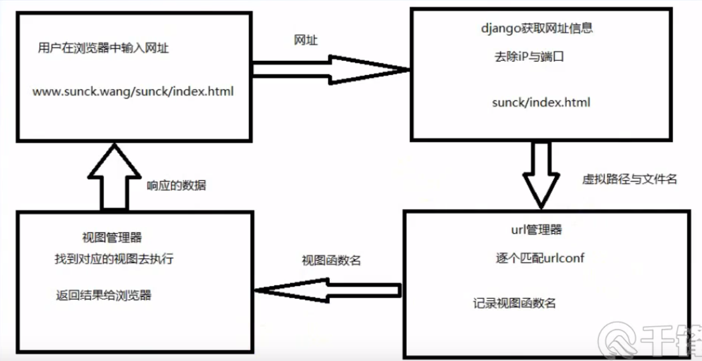

# Django View

## 视图概述

- 作用：接受 web 请求，并响应 web 请求
- 本质：python函数，它接受 Web 请求并且返回 Web 响应。
- 响应
  - 网页
    - 重定向
    - 错误视图
      - 404
      - 500
      - 400
  - json 数据
    - ajax 请求

- 过程：

  

## url 配置

- 配置流程
  - 指定根级配置文件：`ROOT_URLCONF = 'myproject.urls'` 位于项目目录下 settings.py 中，默认会生成
  - `urlpatterns`
    - 一个 url 实例的列表
    - url 对象
      - 正则表达式
      - 视图名称
      - 名称

    - url 正则匹配的注意事项
      - 如果想从 url 中传入一个值，需要对正则加小括号
        - [正则路径中的分组](https://www.runoob.com/django/django-routers.html)
          - 无名分组
          - 有名分组
      - 匹配正则前方不需要加反斜杠
      - 正则前需要加 `r` 表示字符串不转义
      - 注：
        - Django1.1.x 版本  
          - `url()` 方法：普通路径和正则路径均可使用，需要自己手动添加正则首位限制符号。
        - Django 2.2.x 之后的版本  
          - `path()`：用于普通路径，不需要自己手动添加正则首位限制符号，底层已经添加。
          - `re_path()`：用于正则路径，需要自己手动添加正则首位限制符号。

  - 路由分发（include）
    - 存在问题：Django 项目里多个app目录共用一个 urls 容易造成混淆，后期维护也不方便。
    - 解决：使用路由分发（include），让每个 app 目录都单独拥有自己的 urls。
    - 步骤：
      1. 在每个 app 目录里都创建一个 urls.py 文件。
      2. 在项目名称目录下的 urls 文件里，统一将路径分发给各个 app 目录。
      3. 在各自 app 目录下，写自己的 urls.py 文件，进行路径跳转。

  - url 的反向解析
    - 概述：如果在试图、模板使用了硬编码链接，在 url 配置发生变化时，动态生成 url 地址
    - 解决：在使用链接时，通过 url 配置的名称，动态生成 url 地址，
    - 作用：使用 url 模板

## 视图函数

- 定义视图
  - 本质：一个函数
  - 视图参数：
    - 一个 `HttpRequests` 的实例（对象）
    - 通过正则表达式获取的参数（正则分组）
  - 位置：一般在 views.py 文件内定义

- 错误视图
  - 404 视图：找不到网页（url 匹配不成功）
    - 在 template 目录下定义 404.html
      - `request_path`：导致错误的网址
    - 配置 settings.py
      - `DEBUG = True`：如果为 `True`，永远不会调用 404.html 页面
      - `ALLOWED_HOSTS = ['*']`
  - 500 视图：在试图代码中出现错误（服务器代码）
  - 400 视图：错误出现在客户的操作

- 请求对象: HttpRequest 对象（简称 request 对象）

  - 概述：
    - 服务器接收 http 请求后，会根据报文创建 HttpRequest 对象
    - 视图的第一个参数就是 HttpRequest 对象
    - django 创建的，之后调用视图时传递给视图

  - 属性
    - path：请求的完整路径（不包括域名和端口）
    - method：请求的方式，常用的有 GET、POST
    - encoding：表示浏览器提交的数据的编码方式，一般为 utf-8
    - GET：类似于字典的对象，包含了 get 请求的所有参数
    - POST：类似于字典的对象，包含了 post 请求的所有参数
    - FILES：类似于字典的对象，包含了所有上传的文件
    - COOKIES：字典，包含所有的cookie
    - session：类似字典的对象，表示当前会话

  - 方法
    - is_ajax()：如果是通过 XMLHttpRequest 发起的，返回 True
    - ajax 请求一般返回 json 数据

  - QueryDict 对象
    - request 对象中的 GET、POST 都属于 QueryDict 对象（在 HttpRequest 对象中, GET 和 POST 属性是django.http.QueryDict类的实例。）
    - 方法：
      - get()：作用：根据键获取值，但只能获取一个值，如 `www.sunck.wang/abc?a=1&b=2&c=3`
      - getlist()：将键的值以列表的形式返回，可以获取多个值，如 `www.sunck.wang/abc?a=1&a=2&c=3`

  - GET 属性
    - 介绍：
        GET 属性数据类型是 QueryDict，一个类似于字典的对象，包含 HTTP GET 的所有参数。
        有相同的键，就把所有的值放到对应的列表里。使用 getlist() 方法
        取值格式：对象.方法。
        get()：返回字符串
        getlist()：返回列表
    - 目的：获取浏览器传递过来的数据
    - 示例：
      - `http://127.0.0.1:8000/sunck/get1?a=1&b=2&c=3`
      - `request.GET.get('c')`
      - `http://127.0.0.1:8000/sunck/get2?a=1&a=2&c=3`
      - `request.GET.getlist('a')`

  - POST 属性
    - 介绍：
        POST 属性数据类型是 QueryDict，一个类似于字典的对象，包含 HTTP POST 的所有参数。
        常用于 form 表单，form 表单里的标签 name 属性对应参数的键，value 属性对应参数的值。
        取值格式： 对象.方法。
        get()：返回字符串
        getlist()：返回列表
    - 目的：获取浏览器传递过来的数据
    - 示例：
      - `http://127.0.0.1:8000/sunck/showregist/`
      - `http://127.0.0.1:8000/sunck/showregist/regist/`

        ```python
        # POST
        def showregist(request):
            return render(request, 'myApp/regist.html')


        def regist(request):
            name = request.POST.get('name')
            gender = request.POST.get('gender')
            age = request.POST.get('age')
            hobby = request.POST.getlist('hobby')
            print(name)
            print(gender)
            print(age)
            print(hobby)
            return HttpResponse("post")
        ```

- 响应对象：HttpResponse 对象

  - 概述：
    - 作用：给浏览器返回数据
    - HttpRequest 对象是由 django 创建的，HttpResponse 对象是由程序员创建

  - 用法：
    - 不调用模板，直接返回数据  
    HttpResponse(): 返回文本，参数为字符串，字符串中写文本内容。

      ```python
      def index(request):  # request 浏览器请求
          return HttpResponse("sunk is good man!")  # HttpResponse 浏览器响应
      ```

    - 调用模板
      - 使用 render 方法
        - 原型：`render(request, templateName[,content])`
        - 作用：结合数据和模板，返回完整的HTML页面
        - 参数：
          - 第一个参数为 request  请求体对象
          - 第二个参数为字符串（页面名称） 模板路径
          - 第三个参数为 `字典`（可选参数，向页面传递的参数：键为页面参数名，值为要传的参数值），表示传递给模板上的数据。
        - 实例：

          ```python
          def grades(request):
          # 去模板里取数据
          gradesList = Grades.objects.all()
          # 将数据传递给模板，模板再渲染页面，将渲染好的页面返回浏览器
          return render(request, 'myApp/grades.html', {'grades': gradesList})
          ```

  - 属性
    - content：返回的内容
    - charset：编码格式
    - status_code：相应状态码：200、304、404
    - content-type：指定输出的MIME类型

  - 方法：
    - init：使用页面内容实例化 HttpResponse 对象
    - write(content)：以文件的形式写入
    - flush()：以文件形式输出到缓冲区
    - set_cookie(key,value='',max_age=None,emprise=None)：设置 cookie
    - delete_cookie(key)：删除 cookie，如果删除不存在的 key，就当什么都没发生

  - 子类 HttpResponseRedirect
    - 功能：重定向，服务器端跳转
    - 简写：redirect()
      - redirect(to)：重定向，跳转新页面。参数为字符串，字符串中填写页面路径。一般用于 form 表单提交后，跳转到新页面。

        ```python
        from django.shortcuts import redirect


        def redirect1(request):
            # return HttpResponseRedirect('/sunck/redirect2')
            return redirect('/sunck/redirect2')
        ```

        - to 推荐使用反向解析

  - 子类 JsonResponse
    - 返回 json 数据，一般用于异步请求
    - `__init__(self,data)`
      - data：字典对象
      - 注意：Content-type 类型为 application/json

- 状态保持

  - 概述
    - http 协议是无状态的，每次请求都是一次新的请求，不记得以前的请求
    - 客户端与服务器端的一次通信就是一次会话
    - 实现状态保持，在客户端或者服务器端存储有关会话的数据
    - 存储方式
      - cookie：所有的数据都存储在客户端，不要存储敏感的数据，不安全
      - session：所有的数据存储在服务端，在客户端用 cookie 存储 session_id 或者叫 session_key
        - 第一次登录没有 cookie 和 session，第一次登录后需要存储到服务器，之后才能返回给客户端，用于状态保持
    - 目的：在一段时间内跟踪请求者的状态，可以实现跨页面访问当前的请求者的数据
    - 注意：不同的请求者之间不会共享这个数据，与请求者是一一对应的

  - 启动 session
    - `settings.py` 文件默认已启用
      - `INSTALLED_APPS =[ 'django.contrib.sessions',]`
      - `MIDDLEWARE = [ 'django.contrib.sessions.middleware.SessionMiddleware',]`

  - 使用 session
    - 启用 session 后，每个 HttpRequest 对象都有一个 session 属性，就是一个类似字典的对象
    - get(key,default=None)：根据键获取 session 值
    - clear()：清空所有的会话
    - flush()：删除当前的会话，并删除会话的 cookie

  - 设置过期时间
    - set_expiry(value)，value 
    - 为整数，表示秒：`request.session.set_expiry(10)`
    - 时间对象：datatime 或 timedelta
    - 0：关闭浏览器失效
    - None：永不过期
    - 如果不设置，两个星期后过期

  - 存储 session 的位置  
  Django 中，Session 可以保存在数据库中，可以保存到缓冲中，也可以保存到文件中，默认情况下是保存在数据库中，数据库中有一张 session 表。可以通过修改 `settings.py` 文件来修改 session 的保存方式。
    - 数据库，默认保存在数据库中：`SESSION_ENGINE = 'django.contrib.sessions.backends.db'`
    - 保存在文件中：`SESSION_ENGINE = 'django.contrib.sessions.backends.file'`
    - 保存在缓存中：`SESSION_ENGINE = 'django.contrib.sessions.backends.cache'`
    - 同时保存到缓存和数据库中：`SESSION_ENGINE = 'django.contrib.sessions.backends.cache_db'`

  - Django对于Session有一些默认的通用配置，这些默认配置为：

    ```bash
    # SESSION_COOKIE_NAME == "sessionid"  # Session的cookie保存在浏览器上时的key
    # SESSION_COOKIE_PATH == '/'  # Session的cookie保存的路径(默认)
    # SESSION_COOKIE_DOMAIN = None  # Session的cookie保存的域名(默认)
    # SESSION_COOKIE_SECURE = False  # 是否Https传输cookie
    # SESSION_COOKIE_HTTPONLY = True  # 是否Session的cookie只支持http传输(默认)
    # SESSION_COOKIE_AGE = 1209600  # Session的cookie失效日期(2周)(默认)
    # SESSION_SAVE_EVERY_REQUEST = False  # 是否设置关闭浏览器使得Session过期
    # SESSION_COOKIE_AT_BROWSER_CLOSE = False  # 是否每次请求都保存Session，默认修改之后才能
    ```

    这些配置可以在settings.py文件中写入并进行更改

  - 使用 redis 缓存 session
    - `pip install django-redis-sessions`

      ```bash
      SESSION_ENGINE = 'redis_sessions.session'
      SESSION_REDIS_HOST = 'localhost'
      SESSION_REDIS_PORT = '6379'
      SESSION_REDIS_DB = 0
      SESSION_REDIS_PASSWORD = 'htomato'
      SESSION_REDIS_PREFIX = 'session
      ```

- FBV 与 CBV
  - FBV（function base views） 基于函数的视图，就是在视图里使用函数处理请求。
  - CBV（class base views） 基于类的视图，就是在视图里使用类处理请求。

  - FBV
    - 介绍：基于函数的视图，使用了函数来处理用户的请求  
      - `urls.py` 文件，路由配置：  

        ```python
        urlpatterns = [
            path("login/", views.login),
        ]
        ```

      - `views.py` 文件

        ```python
        from django.shortcuts import render,HttpResponse

        def login(request):
            if request.method == "GET":
                return HttpResponse("GET 方法")
            if request.method == "POST":
                user = request.POST.get("user")
                pwd = request.POST.get("pwd")
                if user == "runoob" and pwd == "123456":
                    return HttpResponse("POST 方法")
                else:
                    return HttpResponse("POST 方法1")
        ```

  - CBV
    - 概述：基于类的视图，就是使用了类来处理用户的请求，不同的请求我们可以在类中使用不同方法来处理，这样大大的提高了代码的可读性。
    - 执行对应请求的方法前会优先执行 dispatch 方法(在get/post/put...方法前执行)，dispatch() 方法会根据请求的不同调用相应的方法来处理。

      其实，在我们前面学到的知识都知道 Django 的 url 是将一个请求分配给可调用的函数的，而不是一个类，那是如何实现基于类的视图的呢？ 主要还是通过父类 `View` 提供的一个静态方法 `as_view()`，as_view 方法是基于类的外部接口， 他返回一个视图函数，调用后请求会传递给 dispatch 方法，dispatch 方法再根据不同请求来处理不同的方法。

      - `urls.py` 文件，路由配置：

        ```python
        urlpatterns = [
            path("login/", views.Login.as_view()),
        ]
        ```

      - `views.py` 文件

        ```python

        from django.shortcuts import render,HttpResponse
        from django.views import View

        class Login(View):
            def get(self,request):
                return HttpResponse("GET 方法")

            def post(self,request):
                user = request.POST.get("user")
                pwd = request.POST.get("pwd")
                if user == "runoob" and pwd == "123456":
                    return HttpResponse("POST 方法")
                else:
                    return HttpResponse("POST 方法 1")
        ```