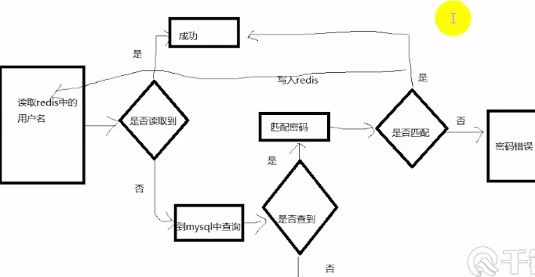

# Redis 特点及使用场景

Redis 是速度非常快的非关系型（NoSQL）内存键值数据库，可以存储键和五种不同类型的值之间的映射。

键的类型只能为字符串，值支持五种数据类型：字符串、列表、集合、散列表、有序集合。

Redis 作为缓存使用粗略示意图：

**数据结构、使用场景** 等参考 [Redis-GitHub (118k Star)](https://github.com/CyC2018/CS-Notes/blob/master/notes/Redis.md)
