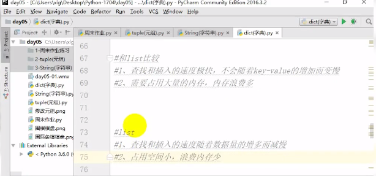

# b站视频学习笔记

## python基础

### day_01（2020.09.12）

- python是一种解释型、面向对象、**动态数据类型**的高级程序设计语言
- 数据存储 内存大小与操作系统位数关系（待理解并整理文档）

### day_02（2020.09.13）

- 数据存储方式 寻址 计算机组成原理理解
- 内存中存取数据 除了数之外的数据
- 原码、补码、反码 重新学习
- 环境变量的配置 原理
- `#!/usr/bin/env python` 作用
- vscode 多行注释 `alt+shift+a`
- `print("age = ")`此处等号右端是否空格
- 函数/命令行中的参数，如 `input([prompt])` 用`[]`包括则说明此参数为非必须参数，可以省略
- python标识符区分大小写，要**见名知意**，python3中非ascii标识符也是允许的，遵循驼峰原则，如变量`lh_Love_Tomato`，首单词字母正常，从第二个单词开始大写，注：函数、模块、常量等暂不讨论
- `del` 关键字，删除对象（变量）

  ```python
    age = 12
    del age
  ```

- markdown 代码段高亮格式（详细总结 换行空几格）
- 作用域 理解 地址

  ```python
    number1 = 1
    number2 = number1
    # 二者地址相同
    print(id(number1))
    print(id(number2))

  ```

- `print((6>7)-(6<7))`
- 该函数对于返回的浮点数并不是按照四舍五入的规则来计算，而会受到计算机表示精度的影响。

  ```python
  >>> round(2.565,2)
  2.56
  ```

- `print "math.floor(119L) : ", math.floor(119L)` `L`代表长整型
- randrange、random、range 这三个函数用法注意区分
- 习惯且熟练使用管道命令
- 学习linux命令新收获
  - history、！511（history中命令序号）
  - ls -h
  - 管道命令理解
  - ls /bin
  - `&&`、`；`、`||`、`&` 多个命令一行输出分别代表的含义
  - `echo $?` ：查看上条命令返回值（判断是否被成功执行）
  - 通配符常用的能看懂
  - more 命令 less命令 区分：less更高级，可搜索关键字、b往上翻页、f往下翻页、N、n查找前一个/后一个关键字
  - `cd -`: 快速回到上次目录，仅记录最近一次
  - `ctr+u`：快速删除命令行内容，`ctrl+c`：中止命令执行
  - `mkdir -p /p/a/t/h` ：创建（不存在）的多级目录
  - `rmdir a`：删除空文件夹
  - direction、dictionary、directory
  - tree 命令的使用

### day_03

- `cat 1.txt 2.txt` 作用：查看多个文件
  - 具体使用：合并多个文件内容到一个文件中，使用重定向
  - `cat 1.txt 2.txt > xxx.txt`
- grep 命令的使用总结文档（回顾）
  - 把要搜索的文件内容列出来
  - `grep "^ntfs" xxx.txt`
- ubuntu 终端开多个标签
  - 命令：`shift+ctrl+t`
  - 多标签切换命令：`alt+数字（1，2，3...）`

### day_04

- `who`命令 ：显示当前所有登陆用户的信息。

  ```shell
  hadoop@liuheng-VirtualBox:~$ who
  liuheng  tty7         2020-09-16 21:14 (:0)
  liuheng  pts/18       2020-09-16 21:59 (192.168.56.106)
  hadoop   pts/19       2020-09-16 21:59 (192.168.56.106)
  ```

- `whoami`：显示系统当前用户名称
- `su - username`和`su username` 区别：前者自动切换到该用户家目录下，后者切换用户，但目录路径依然还是之前的用户的某路径（却决于切换用户之前所在目录）
- `sudo -s` 可以直接切换到管理员 只需要输入当前用户密码而不需输入root账号密码，但此种方式只限于ubuntu系统 其他系统：`su root`
- 软链接和硬链接区别：`ln -s 1.txt 1-softlink.txt` `ln 2.txt 2-hardlink.txt`
- 只有**目录**有x(可执行)权限时，我们才能cd进入该目录！
- vim的学习
  - 待熟练（照着截图练习）
    - 配置 vim 自动补全等快捷键（参考黄老师的代码）编辑此文件：`~/.vimrc`
    - 熟练基本命令后，学习进阶操作（vim分屏）
- 浮点数的算术运算（减运算等）是由问题的（后续解决）

### day_05

- `print(5 ^ 7)`
- `print(13>>2)`结果为3，以及复数的移动，总结理解
- 原码、补码、反码的相互转化熟悉
- [Python非空即真，非零即真](https://www.cnblogs.com/denise1108/p/10018616.html)
- 字符串不可变 `str[1]="a"`# 错误
- [a:b]包含前者不包含后者下标

### day_06

- 为普通用户添加sudo权限，`-a`一般配合`-G`（二者相互配合）来完成向其他组添加  
`sudo usermod -a -G adm username`  
`sudo usermod -a -G sudo username`  

- `print(num1, num2)` 逗号后面要加个空格（最佳实践）
- 字符编码知识拓展学习
- 转义字符理解与使用
- vscode怎么查看源码
- 安装pycharm
- 小于等于即`<=` 大于等于即`>=`
- 嵌套最好不要超过三层

### day_07

- github 搜索信息泄露，github基本的搜索技巧学习

### day_08

- 数据包payload分析 找文章学习
- 查看anaconda3链接到了哪里 `ls -l anaconda3`
- 安装路径（`where is java`） 可执行文件路径（`which java`）

### day_09

- 排查网络故障 总结文档
- 文档排版重新整理
- 未完待续

### day_20201101

- `None` 是python的一个特殊的值，区别理解 `0`

- 列表
  - 浅拷贝：引用拷贝，list2 = list1
  - 深拷贝：内存拷贝，list2 = list1.copy()

- 堆栈理解

- 求解质因数

- while 循环使用 else 语句

- for 循环使用 else 语句

- 最大公约数、六位数验证码（随机）

- pass 语句

  ```python
  for letter in 'Runoob':
    if letter == 'o':
        pass
        print ('执行 pass 块')
    print ('当前字母 :', letter)

  print ("Good bye!")
  ```

- 关于元组是不可变的
  - 所谓元组的不可变指的是元组所指向的内存中的内容不可变。

    ```python
    tuple1 = (1,2,3,[5,6,7])

    # 报错，元组不能变
    # tuple1[0] = 100 
    # tuple[-1] = [7,8,9]

    # 元素为列表，可变，因为列表元素可变
    tuple1[-1] = 500
    print(tuple1)
    ```

  - 创建空元组: `tup1 = ()`
    - 元组中只包含一个元素时，需要在元素后面添加逗号，否则括号会被当作运算符使用：

  - 二维元组

- len(tuple)：计算元组元素**个数**

- string 字符串方法
  - 编码与解码格式要一致，如使用 `utf-8`：`str.encode("UTF-8")`、`str.decode('UTF-8')`

    - bytes.decode(encoding="utf-8", errors="strict")
      Python3 中没有 decode 方法，但我们可以使用 bytes 对象的 decode() 方法来解码给定的 bytes 对象，这个 bytes 对象可以由 str.encode() 来编码返回。
    - encode(encoding='UTF-8',errors='strict')
      以 encoding 指定的编码格式编码字符串，如果出错默认报一个ValueError 的异常，除非 errors 指定的是'ignore'或者'replace'

      ```python
      #!/usr/bin/python3

      str = "菜鸟教程"
      str_utf8 = str.encode("UTF-8")
      str_gbk = str.encode("GBK")

      print(str)

      print("UTF-8 编码：", str_utf8)
      print("GBK 编码：", str_gbk)

      print("UTF-8 解码：", str_utf8.decode('UTF-8','strict'))
      print("GBK 解码：", str_gbk.decode('GBK','strict'))
      ```

- isspace()
  - `\r`、`\n`、`\t`、`\f`、空格...等都是空字符

- dict.items()

  ```python
  dict = {'Name': 'Runoob', 'Age': 7}
  print(dict.items())
  for i,j in dict.items():
      print(i, ":\t", j)
  ```

  - 字典是无序的

  - enumerate() 的使用 枚举器
    - for 循环使用 enumerate()

      ```python
      seq = ['one', 'two', 'three']
      for i, element in enumerate(seq):
      print(i, element)
      ```

- list 和 dict 优缺点对比

  

- 空字典：dict = {}
  - 添加元素

    ```python
    dict = {}
    dict['name'] = 'liu'
    dict['age'] = 6
    print(dict)
    ```

- %.2d 类似含义

- list不能做key值，回顾B站视频，数字 字符串 元组都可以，这些都不可变
  - list是可变对象

- range(0)：一个元素？

- for 和 if 的并列关系 结合B站视频39例题总结
  - for 循环中的变量作用域

### day_20201103

- Python三引号  
  python三引号允许一个字符串跨多行，字符串中可以包含换行符、制表符以及其他特殊字符。实例如下：

  ```python
  #!/usr/bin/python3

  para_str = """这是一个多行字符串的实例
  多行字符串可以使用制表符
  TAB ( \t )。
  也可以使用换行符 [ \n ]。
  """
  print (para_str)
  ```

  执行结果：

  ```text
  这是一个多行字符串的实例
  多行字符串可以使用制表符
  TAB (    )。
  也可以使用换行符 [
  ]。
  ```

### day_20201104

- 标准数据类型（6种）
  - 不可变数据（3 个）：Number（数字）、String（字符串）、Tuple（元组）；
  - 可变数据（3 个）：List（列表）、Dictionary（字典）、Set（集合）。

- 歌词解析代码敲，理解思路，多看代码

- 集合
  - 创建：set()或者{}，创建空set用 set()，{}用来创建空子典
  - 类似dcit，是一组key组合，不存储value
  - 创建set需要一个list或者tuple或者dict作为输入集合
  - 重复元素在set中会被自动过滤，去重功能

    ```python
    s = {1, 2, 3}
    print(type(s))
    s1 = set([1,2,3,5,4,2,3])
    print(s1)
    s2 = set((1,2,2,3,5))
    print(s2)
    s3 = set({1:'name', 2:'age'})
    print(s3)
    ```

  - 元素添加
    - s.add()，不能添加可变对象，如list，不可变对象皆可，字符串、元组
    - 添加单个元素

      ```python
      s1 = set([1, 2, 3, 5, 4, 2, 3])
      s1.add([1, 12, 3]) # add 列表报错
      s1.add((1, 12, 3)) # add 元组没问题
      print(s1) #{1,2,3,5,4,(1,12,3)}
      ```

    - s.update() 插入整个list、tuple、字符串 打碎插入
    - 添加多个元素

      ```python
      s1 = set([1, 2, 3, 5, 4, 2, 3])
      s1.update([1, 12], [6, 7])
      s1.update('sunk')
      print(s1)
      ```

  - 相互转换
    - string、tuple、list、dict可以换为set
    - set不能转换为dict，无value
    - 转换方法：list()、tuple()，str()

- 可迭代对象：可以直接作用于for循环的的对象统称为可迭代对象（Iterable）
  - isinstance() 用来判断一个对象是否是Iterable对象
  
  - 分类，主要有两种数据类型
    - 集合数据类型，如list、tuple、set、string、dict
    - 是generator，包括生成器和带yield的generator function，生成器待理解

      ```python
      from collections import Iterator, Iterable
      print(isinstance([], Iterable))
      print(isinstance([], list))
      print(isinstance((), Iterable))
      print(isinstance({}, Iterable))
      print(isinstance("", Iterable))
      print(isinstance(1, Iterable)) # False
      print(isinstance((x for x in range(10)), Iterable)) # 特殊形式
      ```

    - 不但可以作用于for循环，还可以被next()函数不断调用并返回下一个值，直到最后抛出一个StopIteration错误表示无法继续返回下一个值
      - 可以被next() 函数调用并不断返回下一个值的对象成为迭代器（Iterator对象）
      - 可以使用 isinstance() 来判断一个对象是否是Iterator对象

        ```python
        from collections import Iterator, Iterable
        print(isinstance([], Iterator)) # False
        print(isinstance([], list))
        print(isinstance((), Iterator)) # False
        print(isinstance({}, Iterator)) # False
        print(isinstance("", Iterator)) # False
        print(isinstance(1, Iterator)) # False
        print(isinstance((x for x in range(10)), Iterator)) # True
        ```

        ```python
        l = (x for x in range(5))
        print((next(l)))
        print((next(l)))
        print((next(l)))
        print((next(l)))
        ```

    - 转换成Iterator对象
      - iter()

        ```python
        a = iter([1, 2, 3, 5])
        print(isinstance(iter([]), Iterator))
        ```

    - iter() 函数使用

      ```python
      endstr = "end"
      str = ""
      for line in iter(input, endstr):
        str += line + "\n"
      print(str)

      ```

- 问题

  ```python

    from collections import Iterator, Iterable
    print(isinstance(2, Iterable))

  .\2.py:1: DeprecationWarning: Using or importing the ABCs from 'collections' instead of from 'collections.abc' is deprecated since Python 3.3, and in 3.9 it will stop working
  from collections import Iterator, Iterable
  False
  ```

- 函数
  - return [表达式] 用于退出函数，选择性地向调用方返回一个表达式。其后的语句不再执行，不带参数值的return语句 相当于返回None

  - 值传递：传递的是不可变类型，如string、tuple、number
  - 引用传递：传递的可变类型，如list、dict、set

    

    ```python
    def fun(list):
      list[0] = 100

    li = [1,2,3,5]
    fun2(li)
    print(li) # li本身没有动，只是其内的部分值发生了改变

    ```

  - 栈、堆、常量区、代码区 区别

  - id()

    ```python
    a = 10
    b = 10
    print(id(a),id(b)) # 两个变量地址一样
    c = 20
    d = 30
    print(id(c),id(d))
    d = c
    print(id(d),id(c))

    ```

    

    - 原因；数字Number是不可变类型，不支持修改，变量引用的只是一个地址，而非真实的值
    - 我们只能修改（内存）的栈、堆部分，其他没有权限修改，否则会导致程序崩溃

  - 关键字参数
    - 使用关键字参数允许函数调用时参数的顺序与声明时不一致，因为 Python 解释器能够用参数名匹配参数值

    ```python
    def fun3(age,name):
      print(age,name)

    fun3(name='hooray',age=18) # 注意参数顺序不影响

    ```

  - 默认参数：最好将默认参数放到最后

    ```python
    def fun3(name,age=15):
      print(age,name)

    fun3(name='newbie')
    fun3('htomato')
    fun3(name='hooray',age=18)

    ```

  - 不定长参数：需要一个函数能处理比当初声明时更多的参数。这些参数叫做不定长参数
    - 加了星号 * 的参数会以元组(tuple)的形式导入，存放所有未命名的变量参数。如果在函数调用时没有指定参数，它就是一个空元组

      ```python
      # 格式：
      # def functionname([formal_args,] *var_args_tuple):
      def fun4(name, *arr):
        print(name)
        print(type(arr))
        for x in arr:
          print(x)

      fun4("sunck", "good", "nice", "handsome")
      fun4("sunck")

      ```

    - 还有一种就是参数带两个星号 **基本格式如下：
  
      ```python
      def functionname([formal_args,] **var_args_dict ):
        "函数_文档字符串"
        function_suite
        return [expression]

      ```

      - 加了两个星号 ** 的参数会以字典的形式导入

        ```python
        #!/usr/bin/python3

        # 可写函数说明
        def printinfo( arg1, **vardict ):
          "打印任何传入的参数"
          print ("输出: ")
          print (arg1)
          print (vardict)

        # 调用printinfo 函数
        printinfo(1, a=2,b=3)
        ```

    - 不定长参数格式

      ```python
      def fun(*args, **kargs):
        pass
      ```

    - 声明函数时，参数中星号 * 可以单独出现，例如:

      ```python
      def f(a,b,*,c):
        return a+b+c
      ```

      - 如果单独出现星号 * 后的参数必须用关键字传入：

        ```python
        >>> def f(a,b,*,c):
        ...     return a+b+c
        ...
        >>> f(1,2,3)   # 报错
        Traceback (most recent call last):
          File "<stdin>", line 1, in <module>
        TypeError: f() takes 2 positional arguments but 3 were given
        >>> f(1,2,c=3) # 正常
        6
        >>>
        ```

  - 匿名函数
  python 使用 lambda 来创建匿名函数。
  所谓匿名，意即不再使用 def 语句这样标准的形式定义一个函数。
    - lambda 只是一个表达式，函数体比 def 简单很多。
    - lambda的主体是一个表达式，而不是一个代码块。仅仅能在lambda表达式中封装有限的逻辑进去。
    - lambda 函数拥有自己的命名空间，且不能访问自己参数列表之外或全局命名空间里的参数。
    - 虽然lambda函数看起来只能写一行，却不等同于C或C++的内联函数，后者的目的是调用小函数时不占用栈内存从而增加运行效率。

    - 语法
    lambda 函数的语法只包含一个语句，如下：

      `lambda [arg1 [,arg2,.....argn]]:expression`

      ```python
      #!/usr/bin/python3

      # 可写函数说明
      sum = lambda arg1, arg2: arg1 + arg2

      # 调用sum函数
      print ("相加后的值为 : ", sum( 10, 20 ))
      print ("相加后的值为 : ", sum( 20, 20 ))
      ```

  - [强制位置参数-菜鸟教程](https://www.runoob.com/python3/python3-function.html)

### day_20201105

- [装饰器](https://www.runoob.com/w3cnote/python-func-decorators.html)

- 偏函数
  - `import functools`
  - 把一个参数固定住，形成一个新的函数

    ```python
    import functools

    print(int("1010", base=2))

    # 偏函数
    def int2(str, base=2):
        return int(str, base)
    print(int2("1010"))

    # 把一个参数固定住，形成一个新的函数
    int3 = functools.partial(int, base=2)
    print(int3("111"))
    ```

- [参数传递](https://www.runoob.com/python3/python3-function.html)

  

  - 多练习加以理解

- Python3 命名空间和作用域
  - Python 中只有模块（module），类（class）以及函数（def、lambda）才会引入新的作用域，其它的代码块（如 if/elif/else/、try/except、for/while等）是不会引入新的作用域的，也就是说这些语句内定义的变量，外部也可以访问，如下代码：

    ```python
    >>> if True:
    ...  msg = 'I am from Runoob'
    ...
    >>> msg
    'I am from Runoob'
    >>>
    ```

- 异常处理
  - 用来检测try语句块中的错误，而让except语句捕获错误信息并处理

- assert（断言）

  `assert expression [, arguments]`

  ```python
  def func(num, div):

    assert (div != 0), "div不能为0"
    return num / div

  print(func(10, 2))
  ```

- 文件读取指针位置理解，类似索引？代码测试

- 读文件代码常规写法：

  ```python
  with open(path, "r", encoding="utf-8") as f:
    print(f.read())
  ```

  - 这种写法自动关闭文件（不管程序是否执行成功）

### day_20201106

- 写文件
  - f.flush()：直接把内部缓冲区的数据立刻写入文件，而不是被动的等待自动刷新缓冲区写入。

  - pickle 模块  
  python的pickle模块实现了基本的数据序列和反序列化。  
  通过pickle模块的序列化操作我们能够将程序中运行的对象信息保存到文件中去，永久存储。
    - 对list、tuple、set、dict特殊类型的数据进行写文件和读文件操作
    - 写：`pickle.dump(obj, file, [,protocol])`
    - 读：`x = pickle.load(file)`

      ```python
      #!/usr/bin/python3
      import pickle

      # 使用pickle模块将数据对象保存到文件
      data1 = {'a': [1, 2.0, 3, 4+6j],
              'b': ('string', u'Unicode string'),
              'c': None}
      selfref_list = [1, 2, 3]
      selfref_list.append(selfref_list)

      output = open('data.pkl', 'wb')

      # Pickle dictionary using protocol 0.
      pickle.dump(data1, output)

      # Pickle the list using the highest protocol available.
      pickle.dump(selfref_list, output, -1)

      output.close()

      import pprint, pickle

      #使用pickle模块从文件中重构python对象
      pkl_file = open('data.pkl', 'rb')

      data1 = pickle.load(pkl_file)
      pprint.pprint(data1)

      data2 = pickle.load(pkl_file)
      pprint.pprint(data2)

      pkl_file.close()
      ```

- os、os.path模块

  - `os.path.join(path1[, path2[, ...]])` 把目录和文件名合成一个路径

    - 第二个参数 path2 前边不要有斜杠例：`path2 = 'day03\2.txt'`

  - 拆分路径，返回一个元组

    `os.path.split(path)`

  - os.system()的使用：执行系统命令
    - os.system('cmd')：执行cmd命令

    ```python
    import os
    os.system('notepad')
    ```

- 窗口控制：win32con、win32gui、spy窗口

- 语音控制：win32com

- 内存修改：win32process

- 递归函数：凡是循环能干的事，递归都能干
  - 递归遍历目录练习待做（深度遍历-栈、广度遍历-队列）

  - 写法：

    1. 写出临界条件
    2. 找这一次和上一次的关系
    3. 假设当前函数已经能用，调用自身计算上一次的结果，在求出本次的结果

- 数据结构

  - [嵌套列表](https://www.runoob.com/python3/python3-data-structure.html)
    - 矩阵列表转换
  - 列表推导式

    ```python
    >>> [[x, x**2] for x in vec]
    [[2, 4], [4, 16], [6, 36]]
    ```

  - 同时遍历两个或更多的序列，可以使用 zip() 组合：

     ```python
     >>> questions = ['name', 'quest', 'favorite color']
      >>> answers = ['lancelot', 'the holy grail', 'blue']
      >>> for q, a in zip(questions, answers):
      ...     print('What is your {0}?  It is {1}.'.format(q, a))
      ...
      What is your name?  It is lancelot.
      What is your quest?  It is the holy grail.
      What is your favorite color?  It is blue.
      ```

### day_20201107

- time模块
  - 常用方法：

  

- datetime类
  - datetime类和字符串类型之间的相互转换

- calendar模块

- 模块

  - 内置模块
  - 三方模块（三方库）
  - 自定义模块

  - 可以避免函数名和变量名的冲突

### day_20201108

- [`__name__` 属性](https://blog.konghy.cn/2017/04/24/python-entry-program/)
  - 代码验证：`print(__name__)`

  - 说明： 每个模块都有一个`__name__`属性，当其值是`__main__`时，表明该模块自身在运行，否则是被引入。
  - 说明：`__name__` 与 `__main__` 底下是双下划线，`_ _` 是这样去掉中间的那个空格。

- 文件处理代码整理

- 包：目录只有包含一个叫做 `__init__.py` 的文件才会被认作是一个包，主要是为了避免一些滥俗的名字（比如叫做 string）不小心的影响搜索路径中的有效模块。
  - 最简单的情况，放一个空的file：`__init__.py` 就可以了。当然这个文件中也可以包含一些初始化代码或者为（将在后面介绍的） `__all__` 变量赋值。

- [从一个包中导入*](https://www.runoob.com/python3/python3-module.html)：`from sound.effects import *`
  - 包是一种管理 Python 模块命名空间的形式，采用"点模块名称"。比如一个模块的名称是 A.B，那么他表示一个包 A 中的子模块 B
  - 待补充

- 类
  - 一种数据类型，本身并不占内存空间，跟所学的number、boolean等类似。用类创建实例化对象（变量），对象占内存空间

  - 格式：

    ```python
    class 类名(父类列表):
      属性
      行为

    # 示例代码
    class Person(object):
        # 定义属性
        name = "lihua"
        age = 0
        # 定义方法
        def run(self):
            print("run")


    '''
    实例化对象
    格式：对象名 = 类名（参数列表）
    注意：类名没有参数，小括号不能省略
    '''
    per1 = Person()
    print(per1)
    print(type(per1))

    per2 = Person()
    print(per2)
    print(type(per2))
    ```

  - object ：基类，超类，所有类的父亲，一般没有合适的父类就写object。

  - 类的方法：  
  在类的内部，使用 `def` 关键字来定义一个方法，与一般函数定义不同，类方法**必须包含**参数 `self`, 且为第一个参数，`self` 代表的是类的实例。（第一个参数名称, 按照惯例它的名称是 self。self 不是 python 关键字，我们把他换成 runoob 也是可以正常执行的。）

    ```python
    # 示例代码
    class Person(object):
        # 定义属性
        name = "lihua"
        age = 0
        # 定义方法
        def run(self):
            print("run")
            print(self)
            print(self.__class__)
        # self换成其他，不会报错
        def play(runoob):
            print("play")
    ```

    `def __init__(self,n,a,w,g):`  

    实例化类：实际传参不用给 `self` 赋值  

    `p = people('runoob',10,30)`

### day_20201109

- 堆栈存放哪些变量类型：对象、类

- 类
  - 访问对象属性  
  格式：对象名.属性名  
  赋值：对象名.属性名 = 新值  

- 构造函数（构造方法）  
  在使用类创建对象的时候自动调用  
  如果不显示的写出构造函数，默认会自动添加一个空的构造函数  

  - 类的实例化操作会自动调用 `__init__()` 方法

  `x = MyClass()`

  - 传参

    ```python
    #!/usr/bin/python3

    class Complex:
        def __init__(self, realpart, imagpart):
            self.r = realpart
            self.i = imagpart
    x = Complex(3.0, -4.5)
    print(x.r, x.i)   # 输出结果：3.0 -4.5
    ```

- self
  - 代表类的实例，而非类
  - 哪个对象调用self方法，self就代表那个对象
  - `self.__class__`：代表类名  

    `x = MyClass()` 相当于在类内部这样创建：`x = x.__class__()`

- 析构函数：`__del__()` （用的不多，适用场景待深入）
  - 释放对象时自动调用
  - 释放对象的三种方法：
    - （程序运行结束自动释放对象）（实例看b站视频）
    - 手动释放对象

      ```python
      per = MyClass()
      del per
      ```

    - 在函数里定义的对象，会在函数结束时自动释放，这样可以用来减少内存空间的浪费

      ```python
      def func():
          p = MyClass()

      func()
      ```

- 重写类的专有方法

  - `__str__()`：在调用print打印对象时自动调用，是给用户用的，是一种描述对象的方法。
  - `__repr__()`：是给机器用的，在python解释器里面直接敲对象名再回车后自动调用的方法  
  注意：在没有str时，且有repr，str = repr

    ```python
    # 示例代码
    class Person(object):
        # 定义属性
        name = "lihua"
        age = 0
        # 定义方法
        def run(self):
            print("run")
            print(self)
            print(self.__class__)
        # self换成其他，不会报错
        def play(runoob):
            print("play")
        def __str__():
            return "%s-%d" % (self.name, self.age)

    per = Person()
    # 此时per相当于 per.__str__()
    print(per)
    ```

  - 优点：当一个对象属性值很多，并且需要打印，重写 `__str__()` 方法后简化了代码

  - 练习题：人开枪射击子弹，理解类与对象的关系

- 访问限制
  - 定义私有属性，私有属性在类外部无法直接进行访问
  - 定义私有方法，__private_method：两个下划线开头，声明该方法为私有方法，只能在类的内部调用 ，不能在类的外部调用。self.__private_methods

    ```python
    #!/usr/bin/python3

    #类定义
    class people:
        #定义基本属性
        name = ''
        age = 0
        #定义私有属性,私有属性在类外部无法直接进行访问
        __weight = 0
        #定义构造方法
        def __init__(self,n,a,weight):
            self.name = n
            self.age = a
            self.__weight = weight
        def speak(self):
            print("%s 说: 我 %d 岁。" %(self.name,self.age))

        # 通过内部的方法，去修改私有属性
        # 用过自定义的方法实现对私有属性的赋值
        def setWeight(self, weight):
            # 数据的过滤
            if weight < 0:
                weight = 0
            self.__weight = weight #__weight = _people__weight
        def getWeight(self):
            return self.__weight
    ```

    - 不能访问`per.__money`是因为Python解释器把`__money`变成了`_Person__money`，`_Person__money`才是真正的属性，所以可以用`_Person__money`去访问（如`per._Person__money = 10`），但是强烈建议不要这么干，不同的解释器可能存在解释的变量名不一致

- 特殊变量：`__XXX__`、`_XXX`
  - `__XXX__`
    - 可以直接访问：`print(per.__name__)`

  - `_XXX`（一个下划线）
    - 这样的实例变量外部是可以访问的：`print(per._name)`
    - 按照约定的规则：虽然可以被访问，但是请视为私有变量，不要直接访问

- 继承
  - 耦合和内聚是描述类与类之间的关系，低耦合高内聚。继承的缺点就体现在高耦合。
  - 单继承
    - 私有属性不能继承（被访问），通过继承过来的方法访问私有属性

  - 多继承（继承多个父类）
    - 父类中方法名相同，默认调用在括号中排在前边的父类的方法
    - 子类可以有自己单独的属性和方法

### day_20201110

- 多态

- 对象属性、类属性
  - 类属性用类名来调用，对象属性用对象名调用
  - 对象属性的优先级高于类属性：对象属性和类属性重名了用对象属性，没有对象属性则用类属性，
  - 动态的给对象添加对象属性

  - 删除对象中的name属性：`del per.name`
  
  - 注意：不要将对象属性与类属性重名，因为对象属性会屏蔽掉类属性，当删除对象属性后，再使用就会使用类属性

- 动态语言（灵活）
  - 动态添加属性（给对象）
  - 动态添加方法（给对象），类似偏函数
    - `from types import MethodType`

    ```python
    from types import MethodType

    class Person(object):
        pass

    per = Person()
    per.name = "lilei"
    print(per.name)
    def say(self):
        print(self.name)

    per.speak = MethodType(say, per)
    per.speak()
    ```

  - 限制动态添加属性
    - 定义类的时候，定义一个特殊的属性（__slots__），可以限制动态添加的属性

    ```python
    class Person(object):
        __slots__ = ("name", "age", "speak")
    ```

### day_20201113

- @property
  - 属性直接对外暴露 不安全没有数据过滤。
  - 使用限制访问，需要写set和get方法
  - 使用@property + @.setter 搭配 可以访问受限属性使用点语法写法简单

      ```python
      class Person(object):
          def __init__(self, age):
              # 限制访问
              self.__age = age
              # 数据直接暴露
              # self.age = age


            def getAge(self):
                return self.__age
            def setAge(self, age):
                if age < 0:
                    age = 0
                self.__age = age

      per = Person(18)
      # 属性直接暴露，不安全，没有数据过滤
      # per.age = -10
      # print(per.age)

      # 使用访问限制
      per.setAge(18)
      print(per.getAge())


      #使用@property（类似装饰器）

      # 方法名更改为受限制的变量去掉双下划线(__age)
      @property
      def age(self):
          return self.__age
      @age.setter # 去掉下划线.setter
      def age(self, age):
          if age < 0:
              age = 0
          self.__age = age

      # 等效为以下方法
      # per.setAge(18)
      # print(per.getAge())
      per.age = 100  # 相当于setAge
      print(per.age)  # 相当于getAge
      ```

### day_20201115

- 运算符重载

  ```python
  class Person(object):
    def __init__(self, num):
        self.num = num

    def __add__(self, other):
        return Person(self.num + other.num)
    # 运算符重载
    def __str__(self):
        return "num = " + str(self.num)

  per1 = Person(1)
  per2 = Person(2)

  print(per1 + per2)
  # per1 + per2相当于per1.__add__(per2)
  print(per1.__add__(per2))
  print(per1)
  print(per2)
  ```

- 继承待练习
  - 父类方法改写
  - 找相应模块练习

- 收发邮件

- 银行自动提款机系统

- if 判断 数值型除0外的都是真

  ```python
  a = 0
  b = 0
  c = -54

  if a:
      print("a为真")
  elif b:
      print("b为真")
  elif c:
      print("c为真")
  else:
      print("都不为真")
  ```

- 基础要熟悉
  - Python3.x 中 `input()` 函数接受一个标准输入数据，返回为 `string` 类型。
  - `return [表达式]` 结束函数，选择性地返回一个值给调用方，不带表达式 `return` 的相当于返回 `None`。

- 例题代码或者菜鸟100例题敲

- python 中只有 `while` 循环，没有 `when` 循环

- 对象实例化添加默认属性：
  - 比如以下：`self.cardLock`，构造函数中没有 `cardLock` 相关的参数

  ```python
  class Card(object):
      def __init__(self, cardId, cardPasswd, cardMoney):
          self.cardId = cardId
          self.cardPasswd = cardPasswd
          self.cardMoney = cardMoney
          self.cardLock = False
  ```

- 继承涉及的调用父类构造方法、改写父类方法，下边的代码帮助理解得更清晰

  ```python
  #!/usr/bin/python3
  
  #类定义
  class people:
      #定义基本属性
      name = ''
      age = 0
      #定义私有属性,私有属性在类外部无法直接进行访问
      __weight = 0
      #定义构造方法
      def __init__(self,n,a,w):
          self.name = n
          self.age = a
          self.__weight = w
      def speak(self):
          print("%s 说: 我 %d 岁。" %(self.name,self.age))
  
  #单继承示例
  class student(people):
      grade = ''
      def __init__(self,n,a,w,g):
          #调用父类的构函
          people.__init__(self,n,a,w)
          self.grade = g
      #覆写父类的方法 方法重写
      def speak(self):
          print("%s 说: 我 %d 岁了，我在读 %d 年级"%(self.name,self.age,self.grade))
  
  #另一个类，多重继承之前的准备
  class speaker():
      topic = ''
      name = ''
      def __init__(self,n,t):
          self.name = n
          self.topic = t
      def speak(self):
          print("我叫 %s，我是一个演说家，我演讲的主题是 %s"%(self.name,self.topic))
  
  #多重继承
  class sample(speaker,student):
      a =''
      def __init__(self,n,a,w,g,t):
          student.__init__(self,n,a,w,g)
          speaker.__init__(self,n,t)
  
  test = sample("Tim",25,80,4,"Python")
  test.speak()   #方法名同，默认调用的是在括号中排前地父类的方法
  ```

### day_20201119

- [Python格式化字符串f-string概览](https://blog.csdn.net/sunxb10/article/details/81036693)

### day_20201120

- TODO
  - 银行自动提款机系统代码待补充完整（剩余大概5个函数功能）
  - tkinter GUI 开发熟悉相关组件 待开发个小程序练习（b站案例）

### day_20201126

- pdf文件读取代码补全
- 音乐播放器
- 语音合成以及语音控制游戏

- [Python3中真真假假True、False、None等含义详解](https://cloud.tencent.com/developer/article/1438727)

- python的API文档
- csv、word、pdf文件读取

### day_20201127

- excel、ppt文件读写
- 作业封装为类（大约10次作业待完成）

- python 2与3 区别
  - **待总结：写成思维导图的形式**
  - 编码：默认使用utf-8，变量名更为广泛，支持中文命名，字符串以16-bit Unicode 字符串存储
  - 关键字
  - 算数符号
  - print语句变成了print()函数
- TODO
  - 部分函数待学习6节和正则表达式 一起学习

- python 学习各个阶段知识点总结：[Python学习路线图+14个思维导图](https://www.pythonf.cn/read/4451)

- 买服务器买域名

### day_20201128

- 安老师爬虫原理：发起一个网络请求的完整过程

- robots.txt
  - 爬虫规则（哪些能爬哪些禁止）

- 模块命名冲突问题回顾

- [Python3 JSON 数据解析](https://www.runoob.com/python3/python3-json.html)

- 元组、列表、字典中的字符串最好用单引号

  `dict = {'Name': 'Runoob', 'Age': 7, 'Class': 'First'}`

- 学习 `urllib.request.Request` 的使用

  ```python
  req = urllib.request.Request(url, data=postData)
  req.add_header("User-Agent", agentStr)
  ```

- json 与 str 的关系
  - [困惑点](./Python3示例/爬虫/抓取网页动态Ajax请求的数据.py)

### day_20201129

- `urllib.request.urlretrieve(url, filename= )` 函数的使用
  - 将url内容直接写入到本地文件

  ```python
  urllib.request.urlretrieve(
    "http://www.baidu.com",
    filename=r"C:\Users\liu heng\Desktop\Python学习笔记\文件处理\file\file2.html")
  ```

- 队列模拟练习
  `from collections import deque`

- tcp包和ip包基础理论学习

- `clientSocket, clientAddress = server.accept()` 代码含义

### day_20201207

- MySQL数据库 联表查询学习，待做，顺便练习数据库的一些基本操作及扩展（进阶）操作（有时间的话）

- `cursor.execute("drop table if exits bandcard")` 该语句是否有问题，正确的做法是什么
  - 删除表使用 `DROP TABLE` 语句，`IF EXISTS` 关键字是用于判断表是否存在，只有在存在的情况才删除（MySQL语法不区分大小写）

- `rowcount` 是一个只读属性，返回 `execute()` 方法影响的行数

  ```python
  import mysql.connector

  mydb = mysql.connector.connect(
    host="localhost",
    user="root",
    passwd="123456",
    database="runoob_db"
  )
  mycursor = mydb.cursor()

  sql = "DELETE FROM sites WHERE name = 'stackoverflow'"

  mycursor.execute(sql)

  mydb.commit()
  # mycursor.rowcount 返回 mycursor.execute(sql) 影响的行数
  print(mycursor.rowcount, " 条记录删除")
  ```

- 命名空间学习 理解类中的方法 被对象实例直接调用，以及内部调用的含义

- 一些手册

- 静态界面制作学习 5个

### day_20201208

- 列表中的table菜单：点击tab菜单某选项时，则对应的子内容显示到页面上
- 分类练习各几个，查找备练

- 静态页面待做 以及提升部分

- Django 使用 PyMySQL 数据库遇到的问题：
  `django.core.exceptions.ImproperlyConfigured: mysqlclient 1.4.0 or newer is required; you have 0.10.1.`

  - 解决方法：

    ```python
    import pymysql
    pymysql.version_info = (1, 4, 0, 'final', 0)
    pymysql.install_as_MySQLdb()
    ```

### day_20201212

- 命名空间 python js

### day_20201213

- js数组自定义排序顺序
- 栈、堆保存的数据类型分类 只读数据区 内存区等

- 买书 List ：js、黑客与画家、设计模式、数学之美、python、深入计算机操作系统、人月神话、乔布斯

### day_20201215

- try except 使用场景总结

### day_20201217

- 正则深入理解
  - 理解下面代码中两种正则为何输出结果不同？
  - "()"的作用

  ```python
  def checkPhoneNumber3(str):
    # pat = r'1(3|4|5|6|7|8|9)\d{9}'
    pat = r'1[3456789]\d{9}'
    res = re.findall(pat, str)
    return res

  str4 = "adfkjakdf13022364644ajdfka15236512486dkfjakfjl"
  res5 = checkPhoneNumber3(str4)
  print(res5)
  ```

### day_20201218

正则表达式中组的使用特点

### day_20201221

通过以下代码，理解分隔符的使用特点

```python
str1 = "sunck         is good man"
print(str1.split(' '))
print(re.split(r" +", str1))
```

质量不高凑合看，理解贪婪和非贪婪区别 以及懒惰和非懒惰

```bash
后边多一个？表示懒惰模式。
必须跟在*或者+后边用
如：
如果用正则匹配src中内容非懒惰模式匹配
src=".*"
匹配结果是：src="test.jpg" width="60px" height="80px"
意思是从="往后匹配，直到最后一个"匹配结束

懒惰模式正则：
src=".*?"
结果：src="test.jpg"
因为匹配到第一个"就结束了一次匹配。不会继续向后匹配。因为他懒惰嘛
```

- html 中的锚点回顾

- %d 和 %s 区别

  ```python
  import os

  print("主（父）进程启动-%d"%(os.getpid()))
  print("主（父）进程启动-%s"%(os.getpid()))
  print(type(os.getpid()))
  ```

### day_20201224

- 进程理解、具体实例练习，进程池进程数量怎么设置才能更快更高效
- 继承父类重写父类方法，多练习几个实例
- 调用父类构造方法的写法（怎么判断多少个参数）（封装进程对象有感）

  ```python
  class HtomatoProcess(Process):
    def __init__(self, name):
        Process.__init__(self)
        self.name = name
  ```

### day_20201225

- 知乎对进程和线程的解释看一遍，理解高赞解释的思路：[进程=火车，线程=车厢](https://www.zhihu.com/question/25532384/answer/411179772)

  ```markdown
  做个简单的比喻：进程=火车，线程=车厢

  - 线程在进程下行进（单纯的车厢无法运行）
  - 一个进程可以包含多个线程（一辆火车可以有多个车厢）
  - 不同进程间数据很难共享（一辆火车上的乘客很难换到另外一辆火车，比如站点换乘）
  - 同一进程下不同线程间数据很易共享（A车厢换到B车厢很容易）
  - 进程要比线程消耗更多的计算机资源（采用多列火车相比多个车厢更耗资源）
  - 进程间不会相互影响，一个线程挂掉将导致整个进程挂掉（一列火车不会影响到另外一列火车，但是如果一列火车上中间的一节车厢着火了，将影响到所有车厢）
  - 进程可以拓展到多机，进程最多适合多核（不同火车可以开在多个轨道上，同一火车的车厢不能在行进的不同的轨道上）
  - 进程使用的内存地址可以上锁，即一个线程使用某些共享内存时，其他线程必须等它结束，才能使用这一块内存。（比如火车上的洗手间）－"互斥锁"
  - 进程使用的内存地址可以限定使用量（比如火车上的餐厅，最多只允许多少人进入，如果满了需要在门口等，等有人出来了才能进去）－“信号量”
  ```

- 待理解：`local.x`、`run(local.x, n)` 相关文件：线程-5.ThreadLocal.py
- 函数可以直接获取 while 循环中的变量么？直接传到函数内部？结合变量作用域学习
- while循环中的变量为全局变量？
- 对象和变量的区别 对象全局引用？如下代码引发系列疑惑

  ```python
  import socket
  import threading

  # 创建一个socket
  server = socket.socket(socket.AF_INET, socket.SOCK_STREAM)

  # 绑定IP端口
  server.bind(('10.198.112.111', 8080))
  # 监听
  server.listen(5)


  def run(ck):
      # 没有用到ck变量
      data = clientSocket.recv(1024)
      print("收到" + str(clientSocket) + "的数据" + data.decode("utf-8"))
      # sendData = input("请输入返回给客户端的数据")
      clientSocket.send("sunck is good man".encode("utf-8"))


  print("服务器启动成功，等待客户端链接")
  while True:
      # 等待连接
      clientSocket, clientAddress = server.accept()
      print("%s -- %s 连接成功" % (str(clientSocket), clientAddress))
      t = threading.Thread(target=run, args=(clientSocket,))

      t.start()
  ```

- 完成聊天界面可视化设计 线程部分课程，单独拿出来当作一个小项目
- 涉及作用域，如何理解：

  ```python
  def run():
      while i in range(10):
          print("%s***%d" % (threading.current_thread().name, i))
          time.sleep(2)

  if __name__ == "__main__":
      for i in range(5):
          threading.Thread(target=run).start()
  ```

- 数据结构中的队列、栈、堆理解，结合进程、线程
- 函数返回值为list、元组、字典 怎么return

### day_20201226

- 单元测试详细学习，常见测试方法和原理，了解相关测试库，代码逻辑
- 编码学习，如何编码，为什么编码，编码类型（Linux和windows区别）

- `passwd = ("".join(x) for x in itertools.product("0123745689", repeat=3))` 类似这种代码的写法学习
  - [列表推导式、嵌套列表](https://www.runoob.com/python3/python3-data-structure.html)

- 异常捕获需要注意的点：

  ```markdown
  try 语句按照如下方式工作；
    - 首先，执行 try 子句（在关键字 try 和关键字 except 之间的语句）。
    - 如果没有异常发生，忽略 except 子句，try 子句执行后结束。
    - 如果在执行 try 子句的过程中发生了异常，那么 try 子句余下的部分将被忽略。如果异常的类型和 except 之后的名称相符，那么对应的 except 子句将被执行。
    - 如果一个异常没有与任何的 except 匹配，那么这个异常将会传递给上层的 try 中
  ```

### day_20201227

- `python manage.py shell` 对数据库的基本操作学习、整理
- auto_created=True 、auto_now=True 冲突
- 在定义管理器类中添加一个方法 待理解
- model 添加数据、字段修改、删除待整理笔记补充完整

### day_20201229

- 待理解：`__init__` 方法已经在父类 `model.Models` 中使用，在自定义的模型中无法使用（定义的是类属性）
- 反向解析
- 查看官方文档的视图部分，浏览一遍，区分新老版本的变化
- 表单写法，前端以及 ajax

### day_20201231

- html 中的跳转链接：`<form action="/sunck/showhomepage" method="POST">` 与 django 中的重定向 url：`return redirect('/sunck/homepage')` 写法存在差异？`/sunck/showhomepage` 中 showhomepage 后面加不加 `/`？（好像都可以） 重定向 url 结尾加不加 `/`（好像都可以）？ 留疑待思考测试总结

- cookie 与 session 的理解继续深入
- 获取 session 时 返回 none 的原因
- 使用 redis 缓存 session 重新学习

### day_20210101

- 注意 url 正则的写法，最好末端加上 `/`，加上的话在浏览器输入时可不输入 `/` 浏览器自动添加，正则中不写 `/` 的话，浏览器输入 url 加 `/` 会出错
  `url(r'^(\d+)/$', views.vote),`

- CSRF 同源策略
- 获取 post 数据时返回 None
  - 原因：`<form action="/sunck/showinfo/" method="POST">` 没有写 `method="POST"` 或者 `method="post"`

- `<form action="showinfo/">`：拼接、`<form action="/showinfo/">`：根路径 对比 `<form action="/sunck/showinfo/">`：根路径

- 网站放问过程中那些 cookie token 是相同的

### day_20210102

- 验证码背景颜色修改（有时间）
- 加载 css 等静态文件未成功 静态文件夹配置路径要求？
  ``
  - 待查看官方手册
- 对照 Python-100-Days 补漏查缺

### day_20210103

- 更新主分支内容，子分支中 master 相关文件会更新么，从个人分支合并到 dve 分支，待测试总结
- 多人协作工作模式继续理解，需要测试才能理解的更清楚
- 切换到指定标签：`git checkout tag版本号`
- jqurey、ajax 学习完善 Django 进阶 ajax 部分
- django 后台样式丢失，css 资源加载失败，解决方法，`setting.py` 中 DEBUG 选项为 True，否则无法映射到静态文件目录，参考链接：[django后台样式丢失，css资源加载失败](https://blog.csdn.net/qq_39208536/article/details/81568223)，思考原因

  ```log
  Refused to apply style from 'http://127.0.0.1:8000/static/admin/css/base.css' because its MIME type ('text/html') is not a supported stylesheet MIME type, and strict MIME checking is enabled.
  ```

- 富文本展示有问题

- celery 耗时操作补充完整，基本功能会用

### day_20210104

- python 文件开头  

  ```bash
  <!-- linux中 -->
  #!/usr/bin/python
  # -*- coding: UTF-8 -*-

  <!-- windows -->
  # coding=utf-8
  # -*- coding: UTF-8 -*-

  <!-- python3版本 -->
  #!/usr/bin/python3
  ```

  - 注意转换不同系统平台之间的换行字符，尤其涉及到（shell）
  - 保持一种好的习惯

- 注意 Django 中这几种写法（python3 固定格式）
  `from .models import Grades, Students`  
  `from django.db.models import F, Q`  
  `from . import views`

- 装饰器

  ```python
  admin.site.register(Grades, GradesAdmin)

  @admin.register(Students)
  ```

  以及 auth 组件相关的装饰器：`@login_required`

- `or` 的使用，举例：

  ```python
  a = 0 or 1
  print(a)
  ```

- django 源码待学习

- 模型添加、删除、修改数据待练习补充文档

### day_20210105

- 中间件继续学习，可参考 [Django 中间件](https://www.runoob.com/django/django-middleware.html)

- Django Form 组件后续补充

- 借助 CBV 更好的理解继承，子类调用继承父类的静态方法（`类名.方法名`）以及改写父类的某些方法
  - [python类的实例方法、静态方法和类方法区别及其应用场景](https://blog.csdn.net/helloxiaozhe/article/details/79940321?utm_medium=distribute.pc_relevant_t0.none-task-blog-BlogCommendFromBaidu-1.control&depth_1-utm_source=distribute.pc_relevant_t0.none-task-blog-BlogCommendFromBaidu-1.control)
  - [Python类调用实例方法](http://c.biancheng.net/view/2267.html)
  - 以上内容待整理总结

- 注意：Django 服务器在新添加文件后可能识别不出来，需要重启，但是在现有文件基础上更改能很快识别

- 函数嵌套总结

- python 继承父类后，可以在子类中定义其自身的方法
  - 重新理解封装、继承、多态的概念
  - 多做题，多敲代码，多看代码

- Django Nginx+uwsgi 后续项目部署再进行学习
  - 使用 python manage.py runserver 来运行服务器。这只适用测试环境中使用。
  正式发布的服务，我们需要一个可以稳定而持续的服务器，比如apache, Nginx, lighttpd等。

返回多个值的函数

- 为了能返回多个值，函数直接return一个元组就行了

  ```python
  >>> def myfun():
  ... return 1, 2, 3
  ...
  >>> a, b, c = myfun()
  >>> a
  1
  >>> b
  2
  >>> c
  3


  def myfun():
      return 1, 2, 3


  a, b, c = myfun()
  print("a:", a)
  print(type(a))
  print('b:', b)
  print("c:", c)
  ```

  尽管myfun()看上去返回了多个值，实际上是先创建了一个元组然后返回的。 这个语法看上去比较奇怪，实际上我们使用的是逗号来生成一个元组，而不是用括号

  ```python
  >>> a = (1, 2) # With parentheses
  >>> a
  (1, 2)
  >>> b = 1, 2 # Without parentheses
  >>> b
  (1, 2)
  >>>

  d = 1, 2  # 等同于 d = (1,2)
  print(d)
  print(type(d))
  ```

  当我们调用返回一个元组的函数的时候 ，通常我们会将结果赋值给多个变量，就像上面的那样。 其实这就是1.1小节中我们所说的元组解包。返回结果也可以赋值给单个变量， 这时候这个变量值就是函数返回的那个元组本身了：

  ```python
  >>> x = myfun()
  >>> x
  (1, 2, 3)
  >>>

  a = myfun()
  print(a)
  print(type(a))
  ```

生成器相关知识待继续学习

- [Python 生成器与它的 send，throw，close 方法](https://blog.csdn.net/jpch89/article/details/87036970)

一本优秀的 python 学习手册，目标读者是那些想深入理解 Python 语言机制和现代编程风格的有经验的 Python 程序员。

- [Python Cookbook 3rd Edition Documentation](https://python3-cookbook.readthedocs.io/zh_CN/latest/index.html)

- 进程、线程、协程的应用场景继续深入学习，有时间总结成文档。

### day_20210106

- json 数据用双引号，字符串数据用单引号

- 集合是通过哈希表实现的，所以添加，删除，查找的时间复杂度都是 O(1) 其实不太准确。
  - 正确的复杂度如何待思考总结

- 类属性、成员属性、成员方法、成员变量等名词整理

- try 和 except 使用场景待总结
  - 自定义异常
  - 常见的异常类型总结
  - 清理行为

- 不同数值类型总结比较

- 养成看官方文档的好习惯

- 多问清需求

- 个人优点：追求完美，代码风格简介，无错误（ Python 代码风格的检查工具）

Python变量命名规则：

- 变量名只能包含字母、数字和下划线。变量名可以字母或下划线开头，但不能以数字开头，例如，可将变量命名为 message_1，但不能将其命名为 1_message。
- 变量名不能包含空格，但可使用下划线来分隔其中的单词。例如，变量名 greeting_message 可行，但变量名 greeting message 会引发错误。
- 不要将 Python 关键字和函数名用作变量名，即不要使用 Python 保留用于特殊用途的单词，如 print。
- 变量名应既简短又具有描述性。例如，name 比 n 好，student_name 比 s_n 好，name_length 比 length_of_persons_name 好。
- 慎用小写字母 l 和大写字母 O，因给他们可能被人错看成数字 1 和 0。

  注意：应使用小写的 Python 变量名。在变量名中使用大写字母虽然不会导致错误，但避免使用大写字母是个不错的主意。

Python关键字

```python
>>> keyword.kwlist 
['False', 'None', 'True', 'and', 'as', 'assert', 'async', 'await', 'break', 'class', 'continue', 'def', 
'del', 'elif', 'else', 'except', 'finally', 'for', 'from', 'global', 'if', 'import', 'in', 'is', 'lambda', 'nonlocal', 'not', 'or', 'pass', 'raise', 'return', 'try', 'while', 'with', 'yield']
```

- 基础知识牢固
  - Python列表脚本操作符：列表对 `+` 和 `*` 的操作符与字符串相似。`+` 号用于组合列表，`*` 号用于重复列表。

- break 结束 while 循环

### day_20210107

- [CSS基础：块元素、内联元素、内联块元素](https://www.jianshu.com/p/1cf4e5d9ca2c)
- css 浮动元素待继续理解
